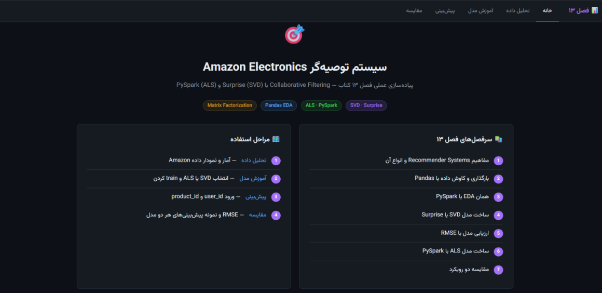
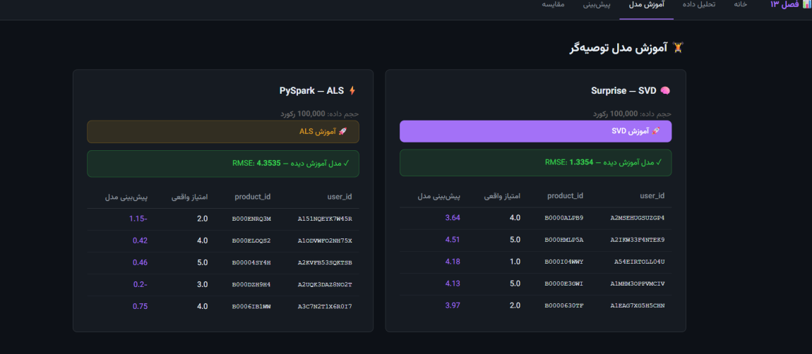
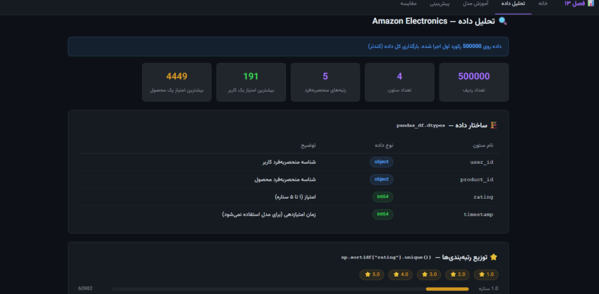
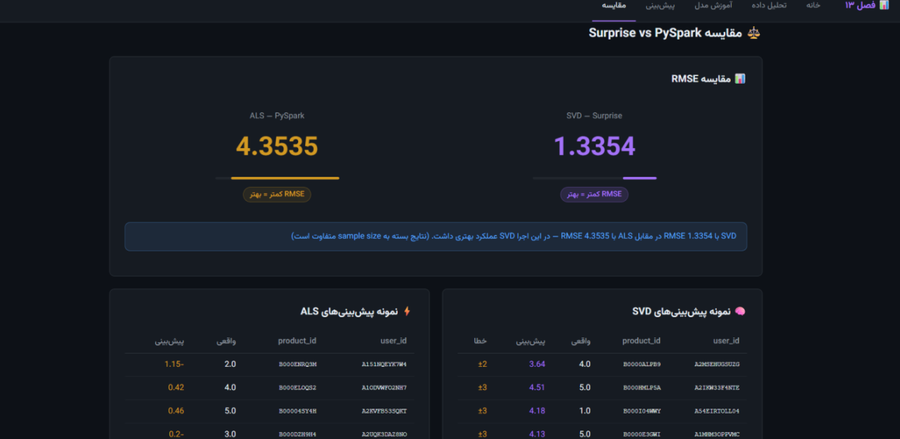
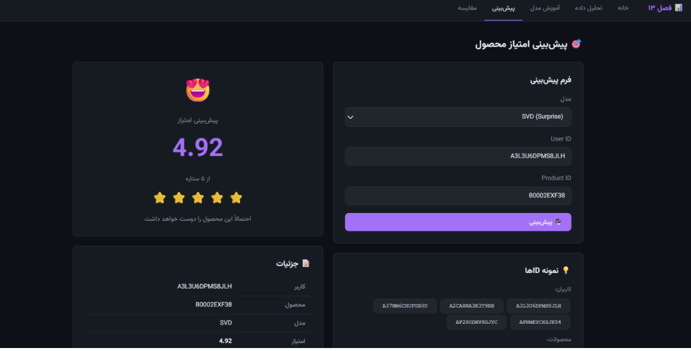

# Recommendation System

Recommendation systems are widely used to identify user preferences and suggest relevant items based on previous interactions.

For **very large datasets**, using algorithms such as **ALS (Alternating Least Squares)** can be particularly useful because ALS is well suited to parallel and distributed processing. By distributing computations across multiple processing resources, ALS can handle larger amounts of data more efficiently and provide better scalability compared with approaches that rely on centralized matrix computations.

This project focuses on implementing a recommendation system using **SVD (Singular Value Decomposition)** and **ALS (Alternating Least Squares)** and evaluating their performance based on execution time.

## Dataset

The dataset contains user interactions with products/items in the form of ratings.

The data is read **directly from an online source** and processed within the application.

Each record contains the following attributes:

* `id_user` – Unique identifier of the user
* `id_product` – Unique identifier of the product/item
* `rating` – User rating from 1 to 5
* `timestamp` – Time at which the rating was recorded

The `timestamp` column is not used during model training.

### Dataset Size

Due to the size of the original dataset, the first **500,000 records** were used for the experiments.

* **Records:** 500,000
* **Columns:** 4
* **Rating scale:** 1–5

## Data Preprocessing

Before the data is used for model training, the following preprocessing steps are performed:

* Handling missing or incomplete values
* Converting the `rating` column to a numerical format
* Checking data consistency and validity
* Shuffling the data before sampling
* Keeping the loaded data in memory to avoid unnecessary repeated loading

## Exploratory Data Analysis

Initial analysis of the dataset shows several characteristics commonly found in recommendation-system datasets:

* Ratings are not uniformly distributed, with a significant proportion of ratings concentrated around 4 and 5.
* Some users have a large number of interactions, while most users have fewer interactions.
* Some products receive considerably more ratings than others.

These characteristics indicate differences in user activity and item popularity within the dataset.

## Recommendation Algorithms

### SVD

**Singular Value Decomposition (SVD)** is used as a matrix-factorization approach for collaborative filtering.

The algorithm decomposes the user-item interaction matrix into latent factors and uses these learned representations to estimate user preferences for items.

### ALS

**Alternating Least Squares (ALS)** is another matrix-factorization approach used for collaborative filtering.

ALS alternates between optimizing user and item latent factors to learn the underlying relationships between users and items.

One of the main advantages of ALS is its suitability for parallel and distributed computation, making it applicable to recommendation systems involving large-scale datasets.

## Web Application

The recommendation system is implemented as a web application using **Django**.

The application provides functionality for:

* Loading and preprocessing the dataset
* Training recommendation models
* Analyzing the data
* Comparing model execution times
* Generating recommendations
* Displaying prediction results through a web interface

## Project Architecture

The general workflow of the project is:

```text
Online Dataset
      │
      ▼
Data Loading
      │
      ▼
Data Preprocessing
      │
      ▼
Recommendation Models
      │
      ├── SVD
      │
      └── ALS
      │
      ▼
Prediction / Recommendation
      │
      ▼
Django Web Interface
```

## Performance Comparison

The execution times obtained for the two recommendation algorithms are:

| Algorithm |        Execution Time |
| --------- | --------------------: |
| SVD       |           ~40 seconds |
| ALS       | ~4 minutes 30 seconds |

The results show that ALS requires more computational time in this experiment compared with SVD. However, execution time on a specific dataset and machine is not the only factor when evaluating a recommendation algorithm. ALS is particularly relevant for large-scale recommendation systems because its computational structure is suitable for parallel and distributed processing.

## Technologies

* **Python**
* **Django**
* **Pandas**
* **NumPy**
* **SVD**
* **ALS**
* **Collaborative Filtering**
* **HTML / CSS**
* **JavaScript**

## Project Structure

```text
recommender_project/
│
├── als_model/
│
├── images/
│   ├── recom_1.png
│   ├── recom_2.png
│   ├── recom_3.png
│   ├── recom_4.png
│   ├── recom_5.png
│   └── Screenshot (438).png
│
├── recommender/
│   ├── ml/
│   │   └── als_model_saved/
│   │       └── model_20260712_090952/
│   │
│   ├── static/
│   │   └── recommender/
│   │
│   └── templates/
│       └── recommender/
│
└── recommender_project/
```

## Conclusion

This project implements a recommendation system based on collaborative filtering using SVD and ALS.

The project demonstrates the complete workflow, including online data loading, preprocessing, exploratory data analysis, model training, performance comparison, and recommendation generation through a Django web application.

The comparison shows that SVD has a shorter execution time for the dataset used in this experiment, while ALS provides an approach that is particularly suitable for scaling recommendation systems to much larger datasets through parallel and distributed processing.

## Project Screenshots

### Recommendation Interface



### Model Training



### Data Analysis



### Model Comparison



### Prediction


